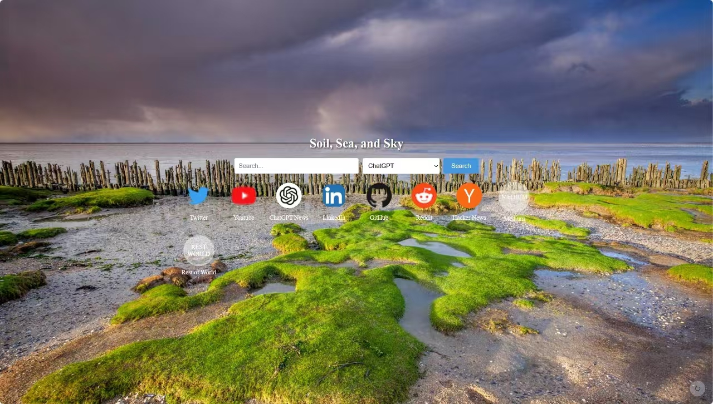

<div align="center">
<p> It's a personal project. Now it's simple, but I use it every day, so it will be perfect in the future, and PRs are welcome.
</p>

</div>

## todo

- server cache image url，base image url
- get knowledge from o1
- get dynamic info from llm
- manual refresh background image
- search engine
- pwa
- The main information data should be stored in the database.
- deploy to github page
- support query params, and can use custom prompt search
- account system

## Setup

Make sure to install dependencies:

```bash
# npm
npm install

# pnpm
pnpm install

# yarn
yarn install

# bun
bun install
```

## Development Server

Start the development server on `http://localhost:3000`:

```bash
# npm
npm run dev

# pnpm
pnpm dev

# yarn
yarn dev

# bun
bun run dev
```

## Production

Build the application for production:

```bash
# npm
npm run build

# pnpm
pnpm build

# yarn
yarn build

# bun
bun run build
```

Locally preview production build:

```bash
# npm
npm run preview

# pnpm
pnpm preview

# yarn
yarn preview

# bun
bun run preview
```

Check out the [deployment documentation](https://nuxt.com/docs/getting-started/deployment) for more information.
